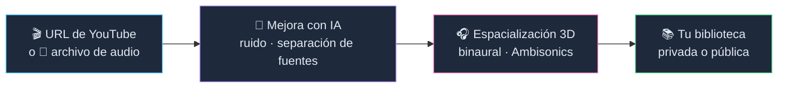
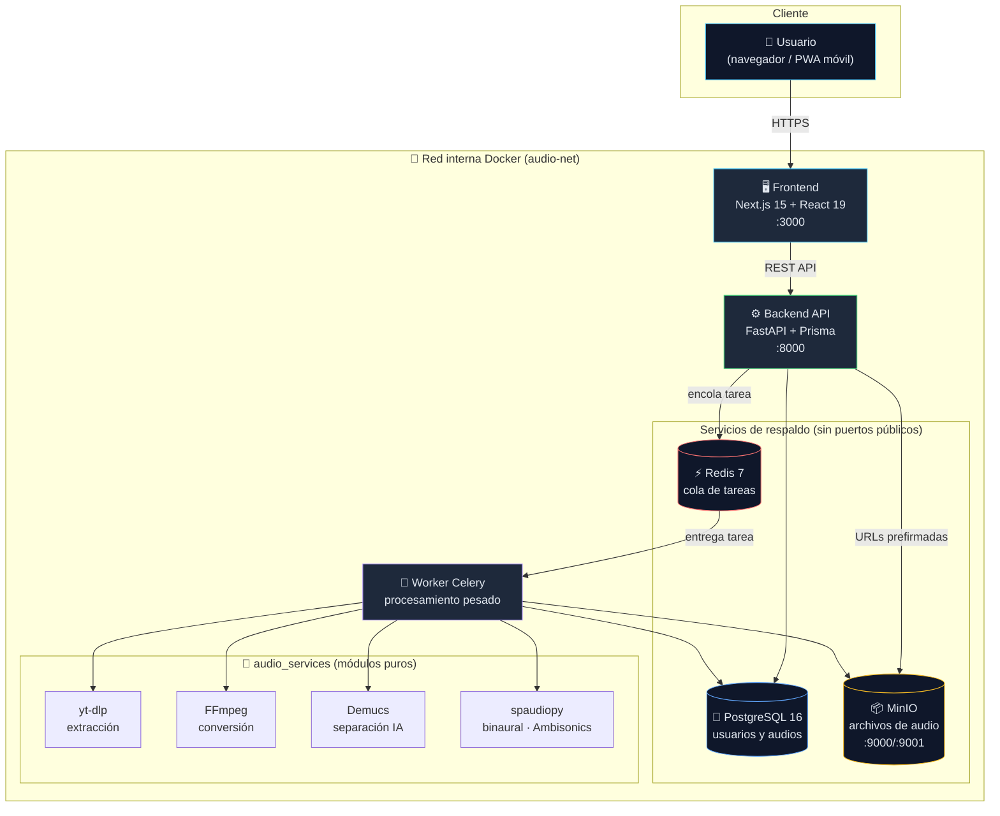
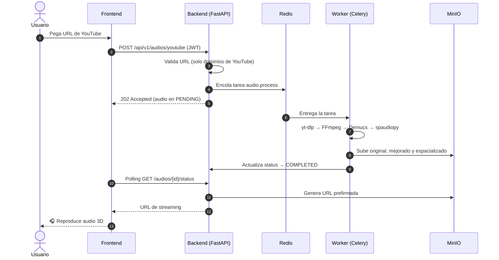
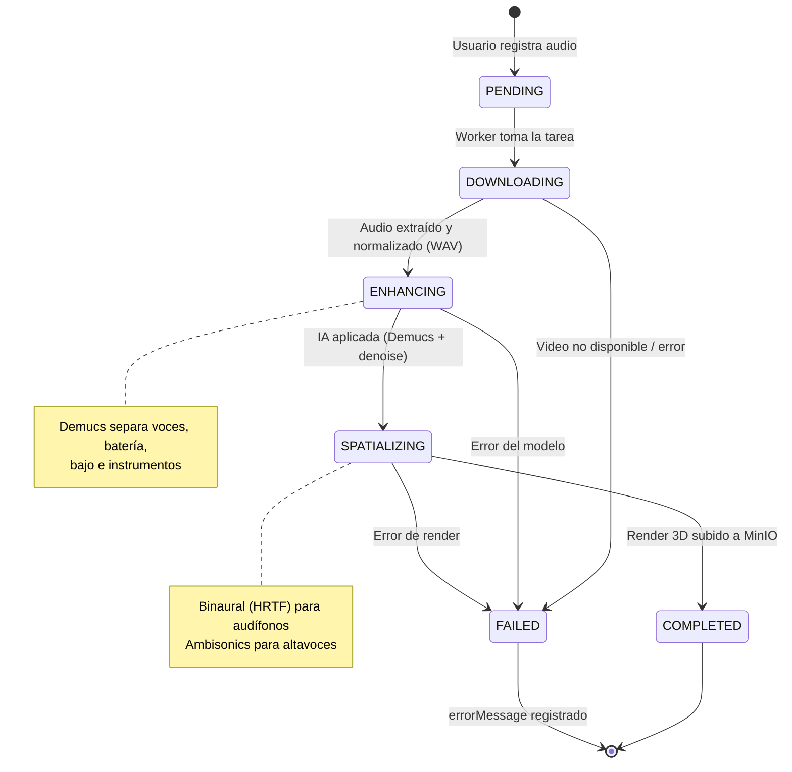
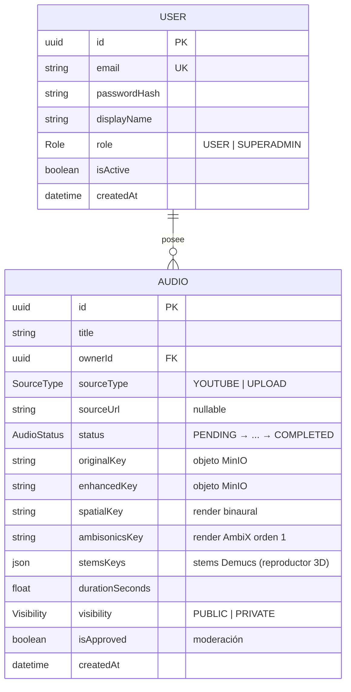
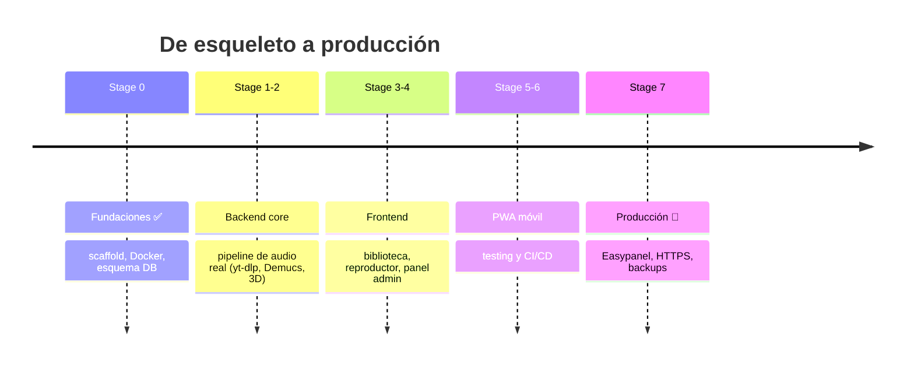

<div align="center">

# 🎵 Audio Inmersivo

**Plataforma auto-alojada para mejorar audio con IA y convertirlo a 3D inmersivo**

[](https://nextjs.org)
[](https://react.dev)
[](https://fastapi.tiangolo.com)
[](https://www.python.org)
[](https://www.postgresql.org)
[](https://redis.io)
[](https://docs.docker.com/compose/)
[](LICENSE)

*YouTube o archivo local → mejora con IA (Demucs) → audio 3D binaural/Ambisonics → tu biblioteca*

</div>

---

## 📑 Tabla de Contenidos

- [Visión del Proyecto](#-visión-del-proyecto)
- [¿Cómo funciona?](#-cómo-funciona)
- [Features](#-features)
- [Arquitectura](#️-arquitectura)
- [Pipeline de Audio](#-pipeline-de-audio)
- [Modelo de Datos](#-modelo-de-datos)
- [Stack Tecnológico](#️-stack-tecnológico)
- [Estructura del Proyecto](#-estructura-del-proyecto)
- [Instalación y Despliegue](#-instalación-y-despliegue)
- [Roadmap](#-roadmap)
- [Seguridad](#-seguridad)

---

## 🎯 Visión del Proyecto

Audio Inmersivo es una plataforma de código abierto diseñada para mejorar la calidad de audio de cualquier fuente (YouTube o archivos locales) utilizando modelos de IA de vanguardia, y convertirlo a formatos de sonido espacial (binaural, Ambisonics) para una experiencia inmersiva.

### ¿Por qué existe este proyecto?

| | |
|---|---|
| 🎛️ **Democratización del audio espacial** | Herramientas profesionales como Dolby Atmos son costosas y complejas |
| 🤖 **Mejora accesible con IA** | Cualquier usuario puede limpiar ruido, separar instrumentos y mejorar calidad |
| 🔒 **Uso local y privado** | Sin dependencia de servicios cloud, sin límites de uso, sin costos recurrentes |
| 🤝 **Comunidad y colaboración** | Biblioteca pública para compartir mejoras y experimentos |

---

## ⚡ ¿Cómo funciona?



---

## ✨ Features

### Para Usuarios

- 🔐 **Autenticación segura**: registro, login, JWT con refresh tokens
- 🎬 **Dos tipos de entrada**:
  - URL de YouTube (extrae audio automáticamente con yt-dlp)
  - Subida de archivos (mp3, wav, flac, m4a, ogg, aac, etc.)
- 🤖 **Mejora con IA**:
  - Reducción de ruido
  - Separación de fuentes con Demucs (voces, instrumentos, bajo, batería)
- 🎧 **Conversión a 3D**:
  - Binaural (audífonos)
  - Ambisonics (altavoces)
- 📚 **Biblioteca dual**: espacio público moderado + espacio privado
- 📱 **PWA móvil**: instalable en iOS y Android

### Para Superadmin

- 👥 **Gestión de usuarios**: crear, editar, desactivar, cambiar roles
- ✅ **Moderación de contenido**: aprobar/rechazar submissions públicas
- 📊 **Métricas del sistema**: cola de procesamiento, almacenamiento, usuarios

---

## 🏗️ Arquitectura

Seis servicios independientes orquestados con Docker Compose. PostgreSQL, Redis y MinIO viven **solo en la red interna**; únicamente el frontend, la API y MinIO exponen puertos.



### Flujo de una petición de procesamiento



---

## 🔄 Pipeline de Audio

Cada audio avanza por una máquina de estados registrada en la base de datos (`AudioStatus`):



---

## 🗃️ Modelo de Datos



---

## 🛠️ Stack Tecnológico

| Capa | Tecnología | Rol |
|------|------------|-----|
| 🖥️ Frontend | Next.js 15 · React 19 · Tailwind CSS v4 | App Router, PWA instalable |
| ⚙️ Backend | FastAPI · Python 3.12+ · Prisma ORM | API REST tipada, OpenAPI |
| 🐘 Base de datos | PostgreSQL 16 | Usuarios, audios, estados |
| ⚡ Caché/Queue | Redis 7 · Celery | Cola de procesamiento asíncrono |
| 📦 Almacenamiento | MinIO (S3-compatible) | Archivos de audio, URLs prefirmadas |
| 🤖 Audio IA | Demucs · noisereduce | Separación de fuentes, limpieza |
| 🎧 Audio 3D | spaudiopy · USAT | Binaural (HRTF), Ambisonics |
| 🎬 Extracción | yt-dlp · FFmpeg | YouTube, conversión de formatos |
| 🔐 Auth | JWT (access + refresh) · bcrypt | Sesiones seguras |
| 🐳 Contenedores | Docker · Docker Compose | 6 servicios aislados |

---

## 📁 Estructura del Proyecto

```text
audio-inmersivo/
├── docker-compose.yml        # Orquestación: frontend, backend, worker, postgres, redis, minio
├── .env.example              # Variables de entorno (copiar a .env)
├── package.json              # Scripts de orquestación (setup, up, db:migrate...)
├── stages.md                 # 🗺️ Roadmap medible a producción
│
├── frontend/                 # Next.js 15 + React 19 + Tailwind v4 + PWA
│   ├── app/                  # App Router (layout.tsx, page.tsx, globals.css)
│   ├── public/               # manifest.json, icons/
│   └── Dockerfile            # Build multi-stage (standalone)
│
├── backend/                  # FastAPI + Prisma + Celery
│   ├── app/
│   │   ├── api/              # deps.py (auth) + v1/endpoints (health, auth, audios, users)
│   │   ├── core/             # config.py (env tipado), security.py (bcrypt, JWT)
│   │   ├── db/               # schema.prisma + client.py (singleton)
│   │   ├── schemas/          # Contratos Pydantic (user.py, audio.py)
│   │   ├── services/         # Lógica de negocio (storage.py → MinIO)
│   │   ├── workers/          # celery_app.py + tasks/audio_tasks.py
│   │   └── main.py           # Factory de la app FastAPI
│   ├── Dockerfile            # Imagen API y worker (arg INSTALL_AUDIO_DEPS)
│   ├── requirements.txt      # Dependencias base (API)
│   └── requirements-audio.txt# Dependencias pesadas de IA (solo worker)
│
├── audio_services/           # Procesamiento puro (sin DB ni API)
│   ├── extractor/            # youtube.py (yt-dlp)
│   ├── enhancement/          # separator.py (Demucs, reducción de ruido)
│   ├── spatial/              # binaural.py (spaudiopy, Ambisonics)
│   └── utils/                # ffmpeg.py (conversión, metadatos)
│
└── infra/                    # Configuración de servicios de respaldo
    └── postgres/init/        # SQL de primer arranque (extensiones)
```

---

## 🚀 Instalación y Despliegue

### Requisitos

- Docker y Docker Compose
- VPS con al menos **4GB RAM, 2 CPU cores, 20GB storage** (8GB RAM recomendado para Demucs)
- Easypanel (opcional, para gestión visual)

### Pasos

```bash
# 1. Clonar repositorio
git clone https://github.com/EmmiSiu/rommag_studio.git
cd rommag_studio

# 2. Configurar variables (crea .env desde .env.example)
npm run setup
#    → edita .env con tus credenciales

# 3. Levantar servicios
docker compose up -d --build

# 4. Aplicar migraciones
npm run db:migrate
```

| Servicio | URL local |
|----------|-----------|
| 🖥️ Frontend | `http://localhost:3000` |
| ⚙️ Backend API (docs) | `http://localhost:8000/docs` |
| 📦 MinIO Console | `http://localhost:9001` |

### Easypanel (producción)

1. Importar `docker-compose.yml` como proyecto
2. Configurar el grupo de variables de entorno en el dashboard
3. Mapear dominios y volúmenes persistentes
4. Deploy automático con Git

---

## 🗺️ Roadmap

El progreso detallado con checklists por sprint vive en **[stages.md](stages.md)**:



**Features futuros:** mix automático con beat-matching · playlists colaborativas · DJ mode · recomendaciones IA · visualizaciones 3D (Three.js + WebAudio) · stems descargables · API pública · exportación Dolby Atmos / DTS:X · social features

---

## 🔐 Seguridad

- 🔑 Autenticación JWT con refresh tokens y hashing bcrypt
- 🧪 Validación de archivos (tipo, tamaño) y de URLs (solo dominios de YouTube — anti-SSRF)
- 🚦 Rate limiting en endpoints críticos
- 🧹 Sanitización de inputs (XSS, SQL injection vía Prisma)
- 🐳 Aislamiento de contenedores: DB y Redis sin puertos públicos, procesos sin root
- 🔒 HTTPS obligatorio en producción (Let's Encrypt)

---

## 📝 Licencia

MIT License — ver [LICENSE](LICENSE).

## 🤝 Contribuciones

¡Bienvenidas! Mira los issues abiertos y envía tu PR.

## 📞 Contacto

- **Autor:** Luis Emiliano Romero Magallanes
- **GitHub:** [EmmiSiu](https://github.com/EmmiSiu)
- **Instagram:** [emmisiu_21_](https://instagram.com/emmisiu_21_)

---

<div align="center">

**Hecho con ❤️ para la comunidad del audio inmersivo**

</div>
