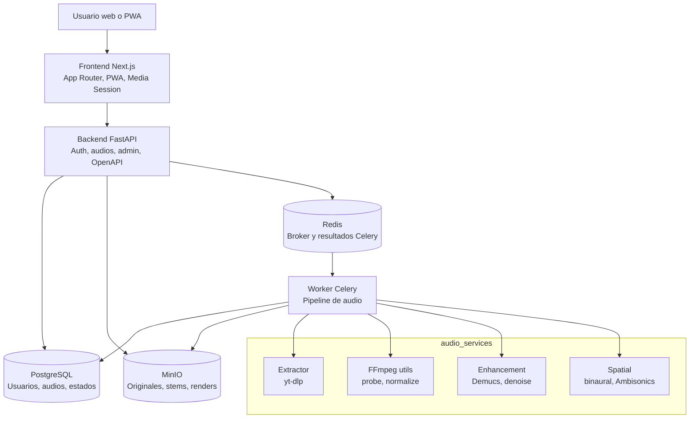
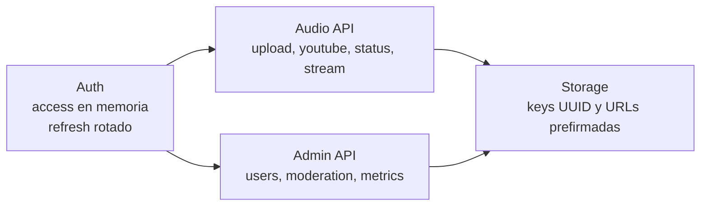
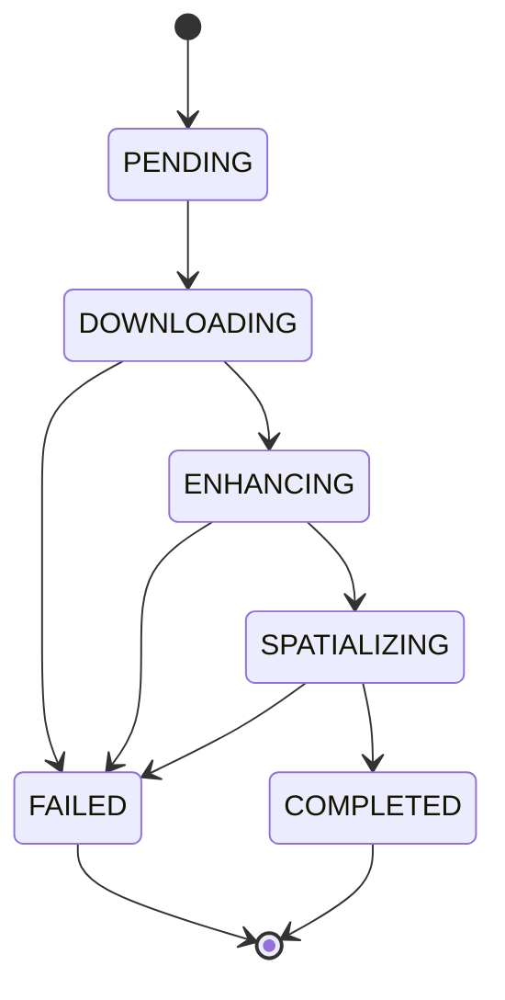

# Arquitectura Funcional

Este documento resume la arquitectura viva de Audio Inmersivo para desarrollo,
testing y despliegue. El sistema separa UI, API, cola, almacenamiento y
procesamiento pesado para mantener cada módulo reemplazable y testeable.

## Contratos Principales

## Estados del Pipeline

