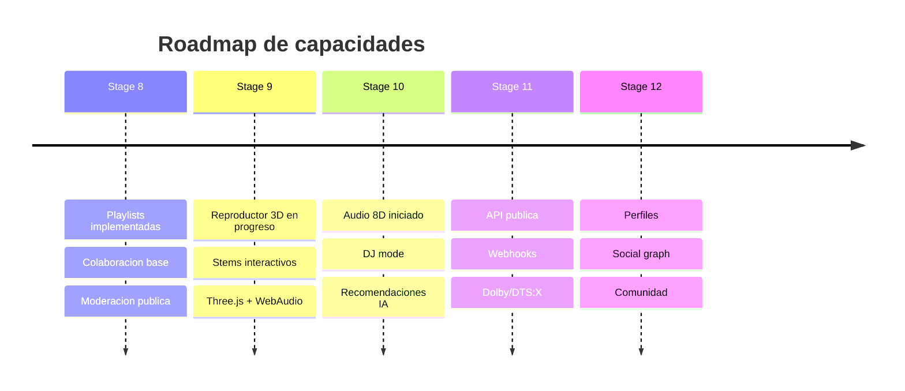
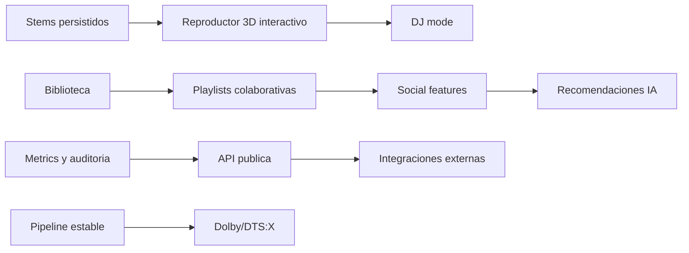

# Feature Roadmap

Este mapa baja los features del README a sprints futuros, cada uno con una
prueba de salida esperada.

## Dependencias entre Features

## Definition of Ready por Sprint Futuro

- Contrato de datos documentado.
- Harness o prueba de aceptacion definida antes de implementar.
- Estados de error y permisos definidos.
- Impacto en PWA/mobile revisado.

## Stage 8 Implementado

- Modelos Prisma: `Playlist`, `PlaylistItem`, `PlaylistCollaborator`.
- API: CRUD de playlists, items, colaboradores y moderacion.
- UI: `/studio/playlists`, `/studio/playlists/[id]` y playlist publica aprobada.
- Harness: tests unitarios de politica owner/editor/viewer/admin.

## Stage 9 En Progreso

- UI: reproductor 3D en `/studio/audio/[id]` para audios completados con stems.
- Motor: WebAudio con `PannerNode`, controles por stem y fallback al render binaural.
- Escena: Three.js con canvas verificado por harness y controles mobile a 375px.
- Presets: `SpatialPresetV1` local por audio, export JSON y tests Vitest.

## Stage 10 En Progreso

- Audio 8D: preset y controles en el reproductor por stems.
- Motor: movimiento orbital sobre `PannerNode` con velocidad, radio y profundidad.
- Analisis musical: BPM, key aproximada, energia y loudness persistidos en DB.
- Harness: `npm.cmd run test:stage10` verifica animación 8D con stems mockeados.
- Harness pipeline: `npm.cmd run perf:pipeline` valida fixtures WAV de BPM/key.
