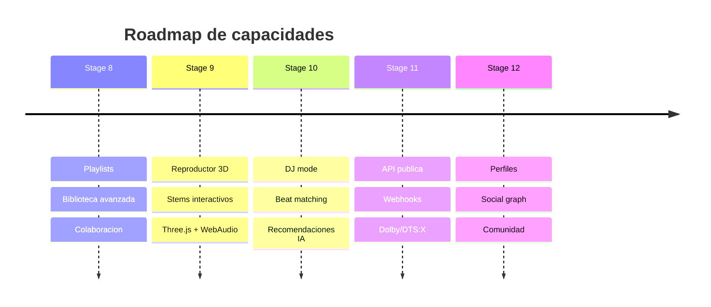
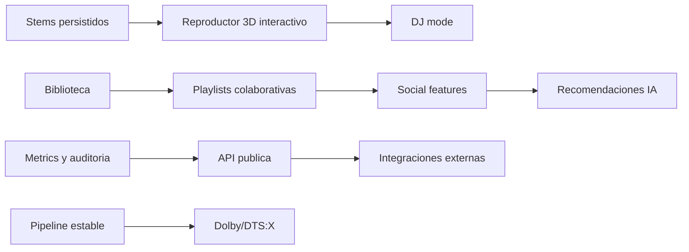

# Feature Roadmap

Este mapa baja los features del README a sprints futuros, cada uno con una
prueba de salida esperada.

## Dependencias entre Features

## Definition of Ready por Sprint Futuro

- Contrato de datos documentado.
- Harness o prueba de aceptacion definida antes de implementar.
- Estados de error y permisos definidos.
- Impacto en PWA/mobile revisado.
