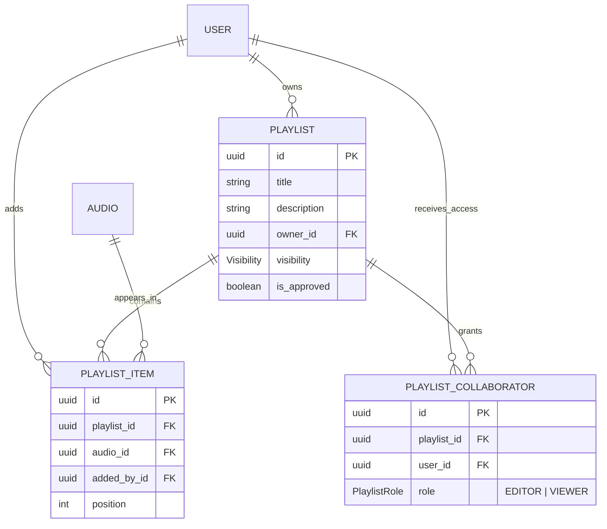
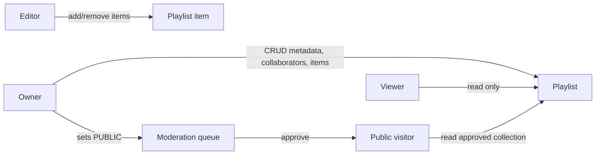

# Playlists and Collaboration

Stage 8 introduces playlists as first-class organization objects. A playlist can
contain owned audio or public approved audio, and can be shared with explicit
collaborator roles.

## Permission Rules

- Owner and superadmin have owner-level access.
- Editor can add/remove items but cannot manage visibility or collaborators.
- Viewer can read private shared playlists.
- Public visitors can read only approved public playlists.
- Playlist items can reference owned audio or public approved completed audio.

## Operational Evidence

- Collaboration changes emit `audit.playlists` logs for invite, role change and
  revoke actions.
- `npm.cmd run test:playlists` provides the live Stage 8 harness when
  `FRONTEND_URL` and `BACKEND_URL`/`API_URL` are available.
- Public playlist pages expose server-side metadata from the approved public
  endpoint; private or unapproved playlists fall back to generic metadata.
