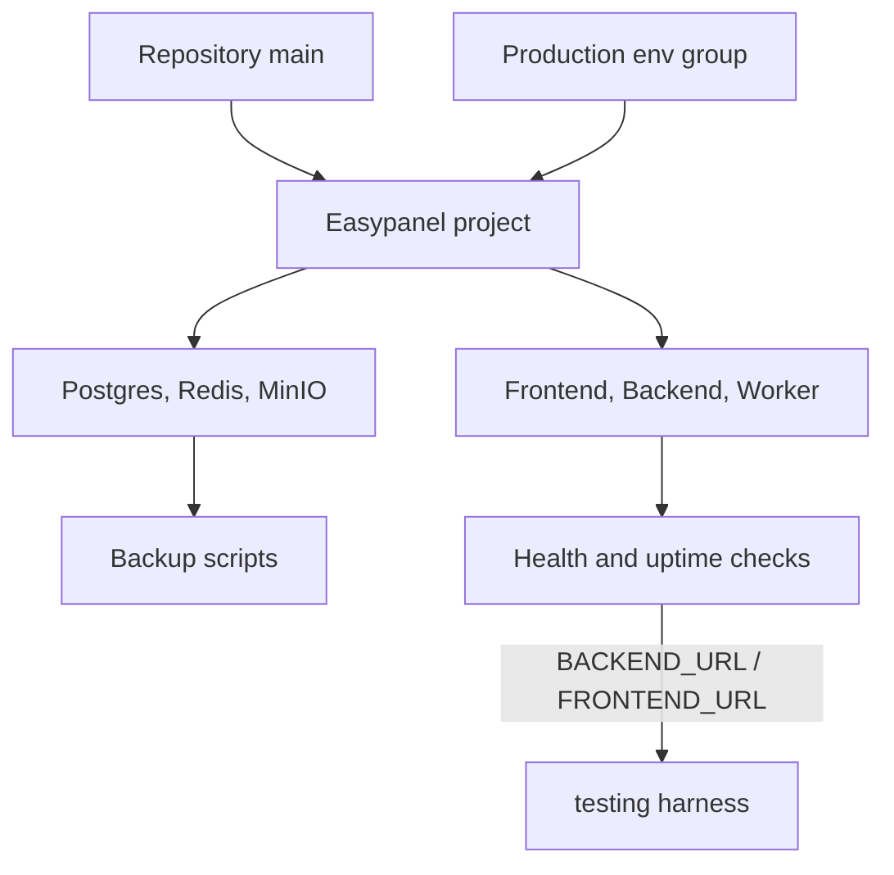

# Production Readiness

Stage 7 depends on real infrastructure, but the repository now contains the
operational assets needed to deploy, verify and recover the system.



## Local Readiness

```bash
npm.cmd run prod:readiness
```

The harness checks:

- Easypanel runbook and production env template exist.
- PostgreSQL and MinIO backup/restore scripts exist.
- PostgreSQL and Redis remain private in compose.
- Demucs model cache is persisted.
- `/docs` is disabled outside development.
- CI still covers PR backend/frontend checks.

## External Gates

These gates must be completed on the production VPS before Stage 7 can close:

- HTTPS domain for frontend, API and media.
- Branch protection and green CI for deployments.
- Successful external user flow on mobile.
- Restore test from PostgreSQL and MinIO backup.
- One week of operation without manual intervention.
