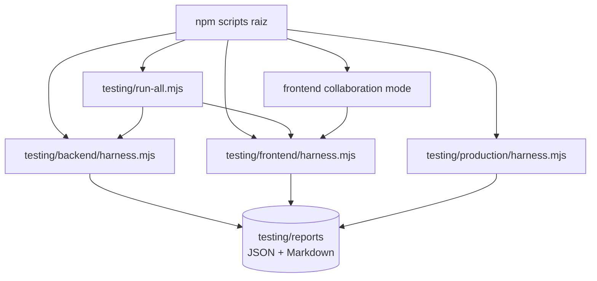
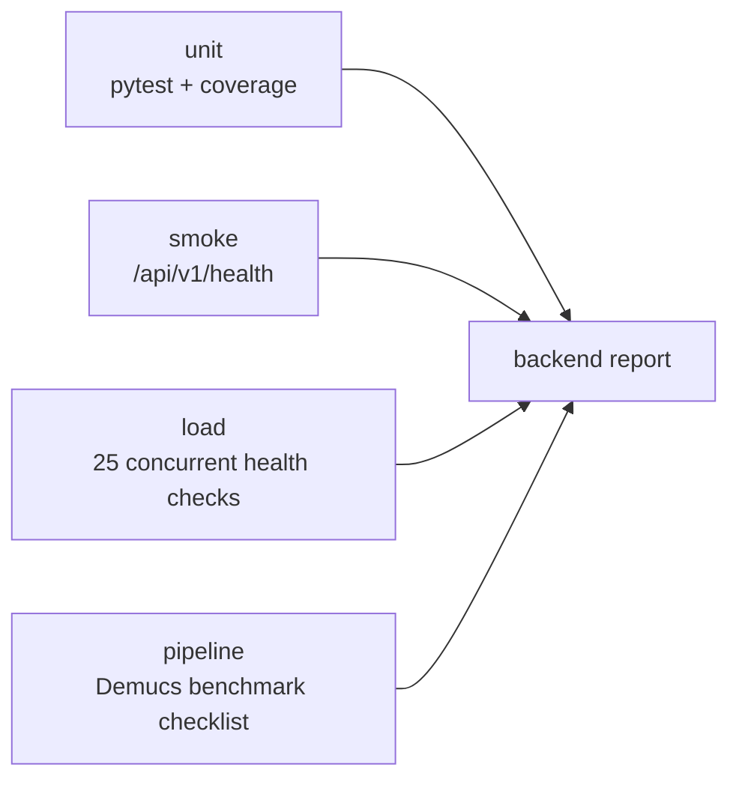
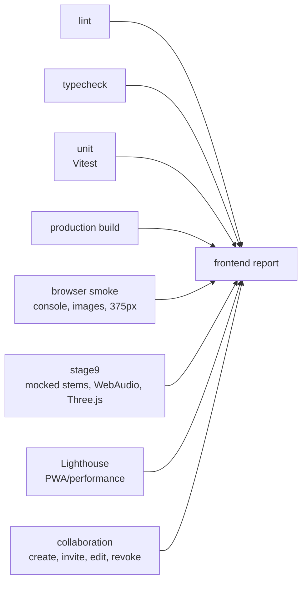
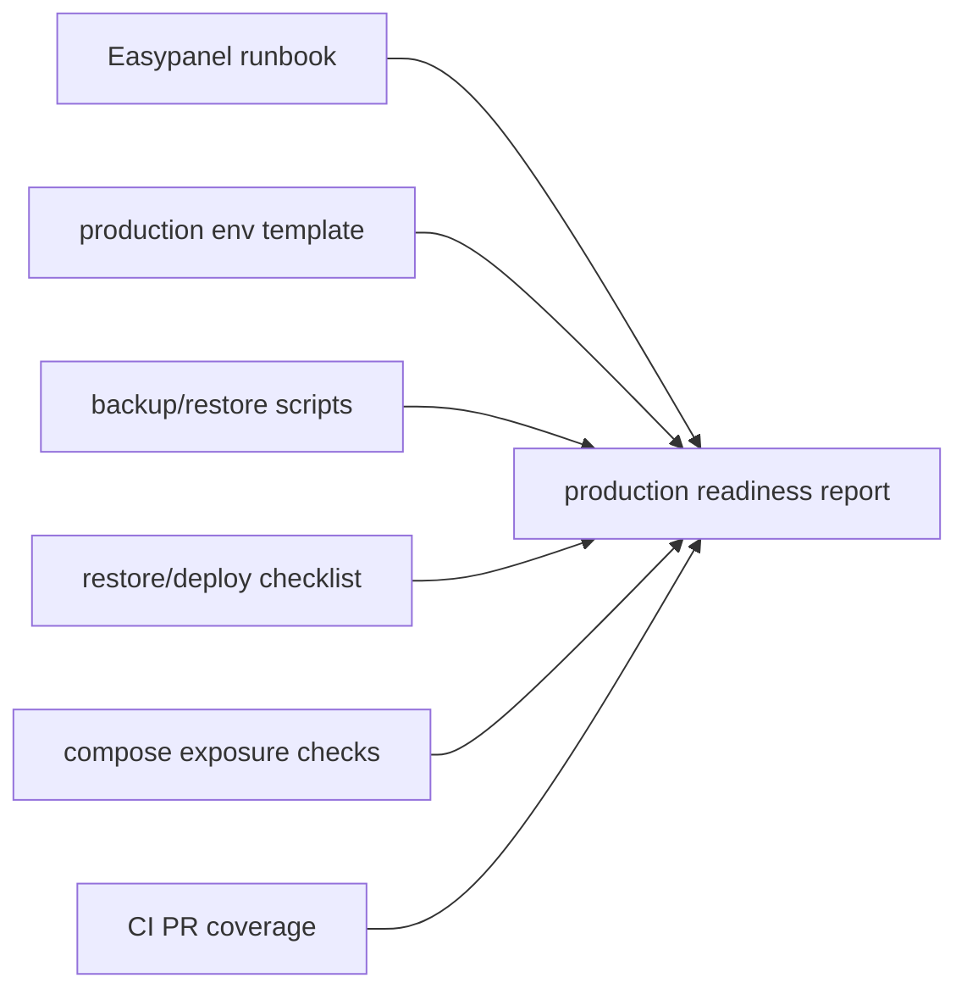

# Testing Harness Architecture

Los harness viven en `testing/` y generan reportes reproducibles en
`testing/reports/`.

## Backend Harness

## Frontend Harness

`node testing/frontend/harness.mjs collaboration` runs only with a live frontend
and API. Without `FRONTEND_URL` plus `BACKEND_URL`/`API_URL`, it records a
controlled skip instead of pretending Stage 8 was verified.

`node testing/frontend/harness.mjs stage9` runs only with `FRONTEND_URL`. It
mocks auth, audio metadata, `/stems` and short WAV files from Playwright, then
loads the private audio detail page, decodes stems through WebAudio, checks
play/pause, verifies a nonblank Three.js canvas and repeats the layout check at
375px.

## Production Readiness Harness

