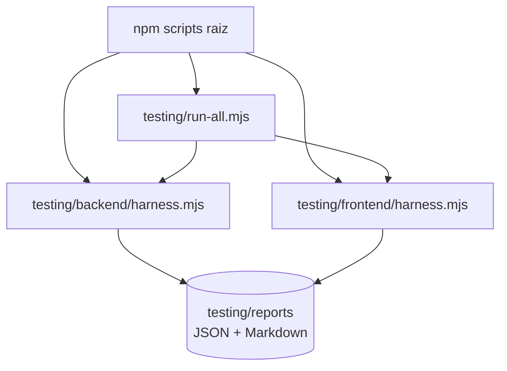
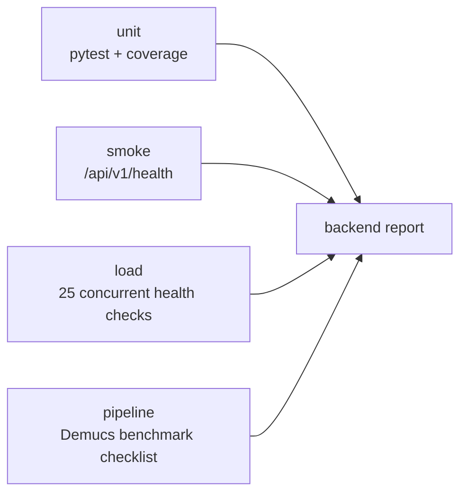
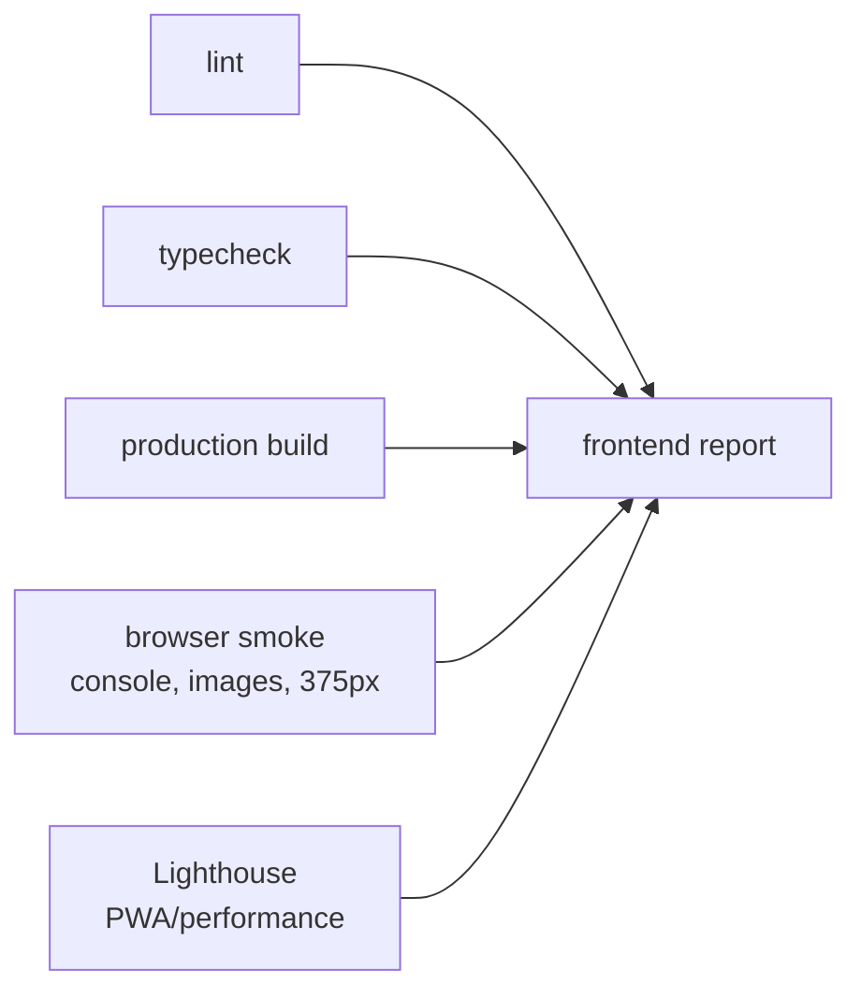

# Testing Harness Architecture

Los harness viven en `testing/` y generan reportes reproducibles en
`testing/reports/`.

```mermaid
flowchart TB
    root["npm scripts raiz"]
    backend["testing/backend/harness.mjs"]
    frontend["testing/frontend/harness.mjs"]
    all["testing/run-all.mjs"]
    reports[("testing/reports\nJSON + Markdown")]

    root --> backend
    root --> frontend
    root --> all
    all --> backend
    all --> frontend
    backend --> reports
    frontend --> reports
```

## Backend Harness

```mermaid
flowchart LR
    unit["unit\npytest + coverage"]
    smoke["smoke\n/api/v1/health"]
    load["load\n25 concurrent health checks"]
    pipeline["pipeline\nDemucs benchmark checklist"]

    unit --> report["backend report"]
    smoke --> report
    load --> report
    pipeline --> report
```

## Frontend Harness

```mermaid
flowchart LR
    lint["lint"]
    typecheck["typecheck"]
    build["production build"]
    browser["browser smoke\nconsole, images, 375px"]
    lighthouse["Lighthouse\nPWA/performance"]

    lint --> report["frontend report"]
    typecheck --> report
    build --> report
    browser --> report
    lighthouse --> report
```
