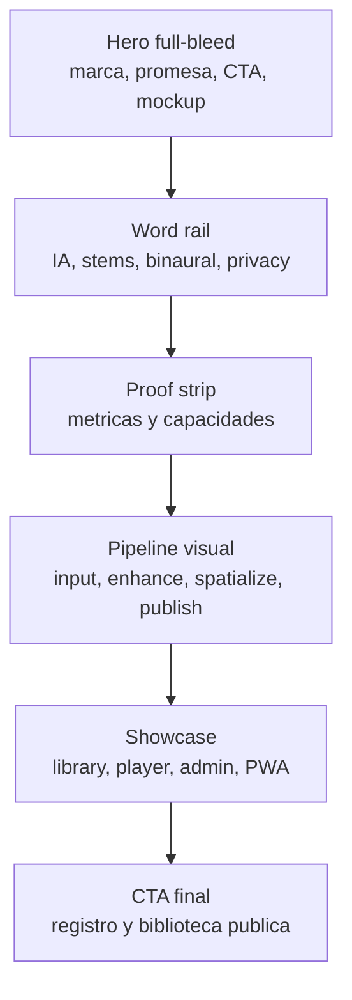
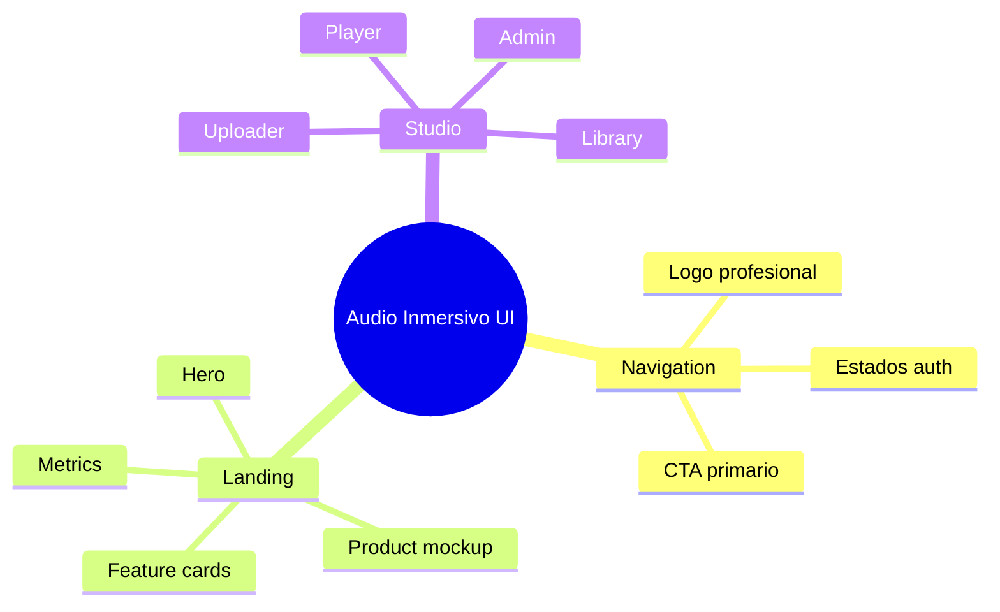

# UI System

La interfaz debe sentirse como una herramienta profesional de audio: precisa,
confiable y visualmente memorable sin depender de decoracion gratuita.

## Principios

- Sin emojis en UI publica: usar iconos profesionales y texto claro.
- Landing con producto visible en el primer viewport.
- Paleta con base oscura y acentos balanceados: cyan, verde, ambar y violeta en dosis controladas.
- Tarjetas solo para elementos repetidos, paneles de herramienta o modales.
- Mobile primero: sin overflow horizontal a 375px.

## Landing

## Componentes Esperados

