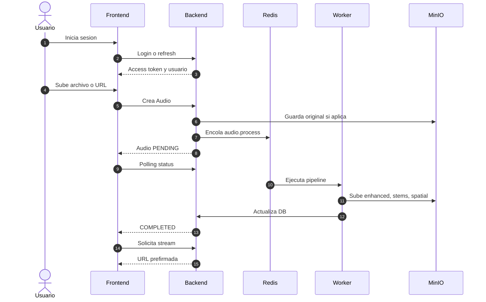
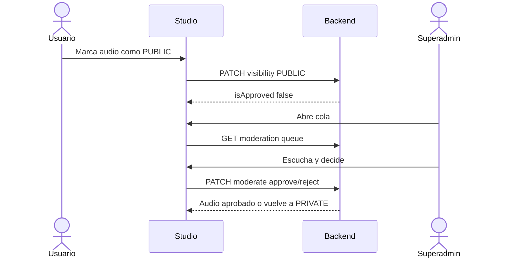

# UX Flows

Los flujos deben minimizar espera incierta. Cada operacion larga muestra estado,
progreso o una ruta de recuperacion.

## Flujo Principal de Usuario

```mermaid
sequenceDiagram
    autonumber
    actor User as Usuario
    participant UI as Frontend
    participant API as Backend
    participant Queue as Redis
    participant Worker as Worker
    participant Store as MinIO

    User->>UI: Inicia sesion
    UI->>API: Login o refresh
    API-->>UI: Access token y usuario
    User->>UI: Sube archivo o URL
    UI->>API: Crea Audio
    API->>Store: Guarda original si aplica
    API->>Queue: Encola audio.process
    API-->>UI: Audio PENDING
    UI->>API: Polling status
    Queue->>Worker: Ejecuta pipeline
    Worker->>Store: Sube enhanced, stems, spatial
    Worker->>API: Actualiza DB
    API-->>UI: COMPLETED
    UI->>API: Solicita stream
    API-->>UI: URL prefirmada
```

## Moderacion

```mermaid
sequenceDiagram
    actor Owner as Usuario
    participant UI as Studio
    participant API as Backend
    actor Admin as Superadmin

    Owner->>UI: Marca audio como PUBLIC
    UI->>API: PATCH visibility PUBLIC
    API-->>UI: isApproved false
    Admin->>UI: Abre cola
    UI->>API: GET moderation queue
    Admin->>UI: Escucha y decide
    UI->>API: PATCH moderate approve/reject
    API-->>UI: Audio aprobado o vuelve a PRIVATE
```
